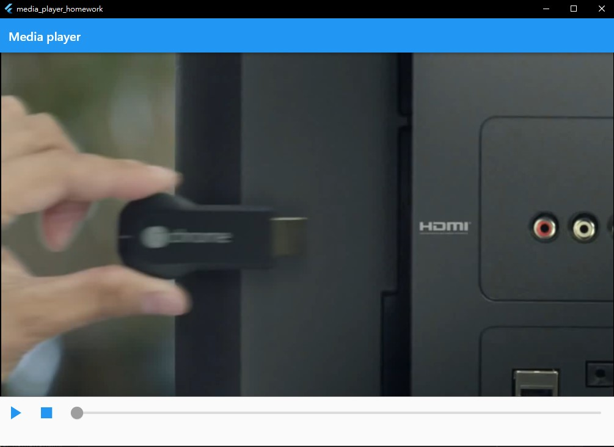

# media_player_homework

A Flutter project that building a vedio player for windows platform with play/pause/stop button and slider(seekBar) using media_kit package and riverpod.

Package:
* [media_kit](https://pub.dev/packages/media_kit)
* [riverpod](https://riverpod.dev/)

Reference code:
* [seekBar](https://github.com/media-kit/media-kit/blob/main/media_kit_test/lib/common/widgets.dart)
* [state management with audio app](https://github.com/imshibaji/FlutterAudioApp)

## Getting Started

This project is a starting point for a Flutter application.

A few resources to get you started if this is your first Flutter project:

- [Lab: Write your first Flutter app](https://docs.flutter.dev/get-started/codelab)
- [Cookbook: Useful Flutter samples](https://docs.flutter.dev/cookbook)

For help getting started with Flutter development, view the
[online documentation](https://docs.flutter.dev/), which offers tutorials,
samples, guidance on mobile development, and a full API reference.
